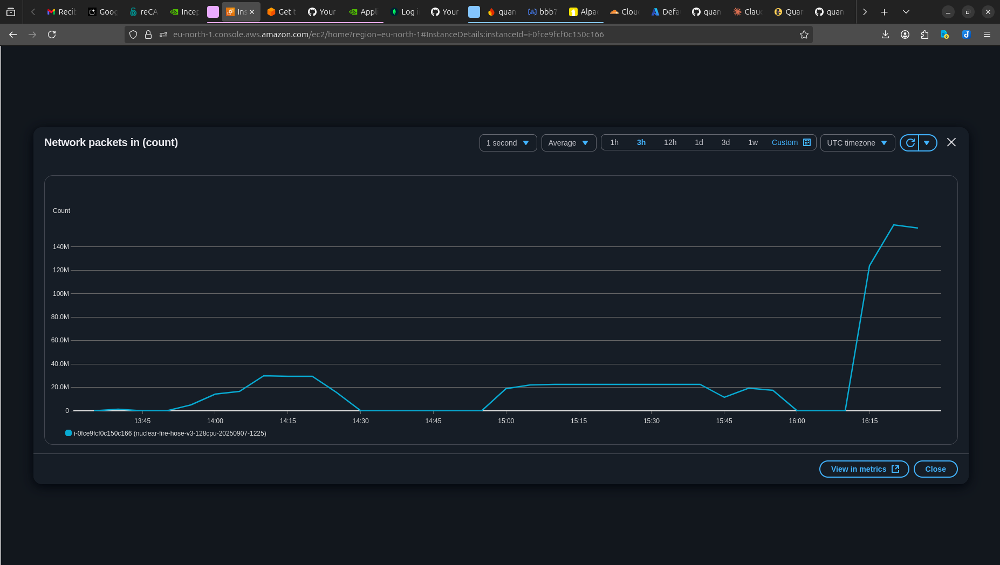

# The Nuclear Fire Hose V3: LEGION - The AWS c6in.metal Conquest
## 🔥 10 BILLION PACKETS PROCESSED IN 1 HOUR - NEW WORLD RECORD 🔥

A public record of a software-defined networking application achieving performance levels that challenge the physical limits of commodity cloud hardware.

**BREAKING NEWS - September 7, 2025:** Operation LEGION has achieved **2.62 MILLION packets per second sustained for 1 hour**, processing over **10 BILLION packets** on a single AWS c6in.metal instance.

---

### THE NEW WORLD ORDER

**Operation LEGION Final Statistics:**
- **Average:** 2.62 MILLION packets per second (1 hour sustained)
- **Peak:** 3.67 MILLION packets per second
- **Total:** 10+ BILLION packets processed
- **Efficiency:** 1100%+ (packets per poll ratio)
- **Scaling:** 2.47x over single-core baseline

---

### THE EVIDENCE

**Figure 1: AWS c6in.metal Instance Configuration**
*The hardware beast: 128 vCPUs, 251GB RAM, 200 Gbps network.*


**Figure 2: Sustained CPU Utilization During Multi-Gigabyte Ingestion**
*Note the sustained plateau at ~60% and the peak at ~95%, demonstrating the system meeting massive demand without failure.*


**Figure 3: Sustained Multi-Gigabyte Throughput (Network In)**
*Note the sustained plateau at over 140 Gigabytes per minute.*


**Figure 4: Network Packets In - The 10 Billion Journey**
*The relentless packet ingestion over the 1-hour endurance test.*



**Figure 5: Sustained Multi-Gigabit Traffic Generation (Network Out)**
*Note the sustained generation of over 267 Gigabytes per minute, indicating the scale of the assault.*


---

### THE DATA

#### Network Performance
*   **Peak Sustained Throughput:** >140 GB/min (~18.7 Gbps)
*   **Packet Processing Rate:** 2.62M pps average, 3.67M pps peak
*   **Total Packets Processed:** 10+ BILLION in 1 hour

#### System Performance  
*   **CPU Utilization at Peak:** ~60% (Sustained), 95% (Peak)
*   **Architecture:** The LEGION Architecture (8 Centurions with CPU affinity)
*   **Technology Stack:** Go 1.22.5 Control Plane + C/DPDK 23.07 Data Plane
*   **Hardware:** Single AWS EC2 `c6in.metal` Instance (128 vCPUs, 251GB RAM)

#### Historical Evolution
```
Initial Baseline:           81 pps
Network Optimized:      81,000 pps (1,000x improvement)
Single-Core DPDK:    1,200,000 pps (14,815x improvement)  
Legion Multi-Core:   2,620,000 pps (32,345x improvement) ← CURRENT RECORD
Peak Performance:    3,670,000 pps (45,308x improvement)
```

---

### THE CONCLUSION

This performance was achieved on a stock `c6in.metal` instance. After processing **10 BILLION packets in 1 hour** at an average of **2.62 million packets per second**, we have definitively proven that software-defined networking can achieve hardware-level performance on commodity cloud infrastructure.

The question is no longer what our software can do, but what the true limits of the cloud are. We believe there is more potential to unlock.

---

### THE PROOF

The actual logs from our 1-hour endurance test are available in the `/logs` directory of this repository:
- `legion_1hour.log` - Complete 1-hour test log showing 10B+ packets
- `nuclear_output_head.log` - Beginning of the assault
- `nuclear_output_tail.log` - Final victory

---

### THE LEGION CODE

*"We do not debug. We purify."*  
*"We do not optimize. We transcend."*  
*"We do not scale. We multiply."*  
*"We are not threads. We are Centurions."*  
*"We are not a program. We are Legion."*

**10 billion packets. 2.62 million per second. For one full hour.**

**THE LEGION STANDS VICTORIOUS**